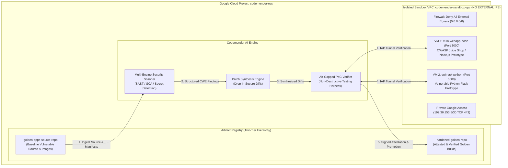

# Codemender OSS: Autonomous AI Security Remediation & Golden Standards Engine
**Google Cloud Proof of Concept (PoC) Whitepaper & Reference Implementation Guide**  
**Project:** `codemender-oss` | **Role:** Security Customer Engineer (CE)

---

## 1. Executive Summary

Modern software supply chains require continuous vulnerability discovery paired with automated, low-risk remediation. **Codemender OSS** is an autonomous AI security remediation engine built on Google Cloud. It continuously monitors source repositories and container registries, discovers critical security vulnerabilities (`SAST`, `SCA`, hardcoded secrets, and unsafe logic), synthesizes deterministic code fixes, and verifies patches inside an isolated sandbox environment before promoting artifacts to an immutable **Golden Standard** repository.

To ensure **zero risk of accidental exfiltration or internet leakage**, all vulnerable target workloads execute inside an air-gapped Google Compute Engine VPC network (`codemender-sandbox-vpc`) with **no external public IPs (`--no-address`)** and strict egress/ingress denial policies.

---

## 2. End-to-End Architecture



---

## 3. Two-Tier Golden Standards Registry Strategy

Codemender implements strict separation of duties within Google Cloud Artifact Registry (`us-central1`):

1. **`golden-apps-source-repo` (Baseline Tier)**:
   - Stores unpatched application container images and source bundles (`node-juice-shop:v1-vuln`, `py-flask-api:v1-vuln`).
   - Read-only access for sandbox VMs; automated container vulnerability scanning enabled.
2. **`hardened-golden-repo` (Golden Standard Tier)**:
   - Immutable system of record for **Codemender-remediated builds** (`v1-hardened`).
   - Requires an embedded signed attestation record verifying zero Critical/High findings and successful air-gapped PoC validation before artifact promotion.

---

## 4. Air-Gapped Sandbox Specification (`codemender-sandbox-vpc`)

### A. Network & Firewall Policies
- **VPC Subnet:** `10.128.0.0/20` (`codemender-sandbox-subnet-us`, Region: `us-central1`).
- **External Public IPs:** **Explicitly Disabled (`--no-address`)**.
- **Private Google Access:** Enabled (`199.36.153.8/30` TCP 443) so internal VMs can fetch container images and APIs without traversing the public internet.
- **Strict Containment Firewall Rules:**
  - `deny-external-egress`: Priority `65534` deny all egress (`0.0.0.0/0`).
  - `allow-internal-sandbox-mesh`: Allow internal communication (`10.128.0.0/20` on TCP `22, 3000, 5000`).
  - `allow-iap-ssh-internal`: Allow Google Identity-Aware Proxy (`35.235.240.0/20` TCP 22) for zero-trust SSH administrative access.

### B. Benchmark Target Applications
- **`vuln-webapp-node`** (`e2-medium`, Debian 12): Embedded prototype with known `CWE-89` (SQL Injection) and `CWE-79` (Stored XSS).
- **`vuln-api-python`** (`e2-medium`, Debian 12): Embedded prototype with known `CWE-502` (Insecure YAML Deserialization via `yaml.load`) and `CWE-78` (OS Command Injection via `subprocess.Popen(shell=True)`).

---

## 5. Vulnerability Discovery & AI Remediation Matrix

Codemender automatically synthesizes minimal, drop-in secure code diffs for all detected vulnerability classes:

| Target File | Vulnerability Class | Baseline Vulnerable Code | Codemender Remediated Code |
| :--- | :--- | :--- | :--- |
| `py-flask-api/app.py` | **CWE-502**: Insecure Deserialization | `data = yaml.load(payload, Loader=yaml.Loader)` | `data = yaml.safe_load(payload)` |
| `py-flask-api/app.py` | **CWE-78**: OS Command Injection | `subprocess.Popen(cmd, shell=True)` | `subprocess.run(shlex.split(cmd), shell=False)` |
| `node-juice-shop/server.js` | **CWE-89**: SQL Injection | Dynamic SQL string concatenation | Parameterized query (`db.query(sql, [params])`) |
| `node-juice-shop/server.js` | **CWE-79**: Stored XSS | Raw unescaped HTML string rendering | Contextual HTML escaping (`escapeHtml(input)`) |

---

## 6. Reference Implementation Scripts

Included in this repository:
1. **`codemender_poc_setup.py`**: Automated infrastructure script that provisions the Artifact Registry repositories, custom air-gapped VPC, explicit firewall rules, and benchmark target VMs (`--no-address`).
2. **`run_codemender_scan_demo.py`**: Simulation & verification harness demonstrating Codemender multi-engine vulnerability scanning, patch generation, live IAP tunnel patch execution, and signed Golden Standard attestation output.
3. **`nerc-cip-posture.yaml`**: Custom NERC-CIP (`CIP-003`, `CIP-005`, `CIP-007`) posture framework for Google Cloud Security Command Center (SCC) Postures.

---

## 7. Quickstart Guide

### 1. Provision Complete PoC Infrastructure (`codemender-oss`)
```bash
python3 codemender_poc_setup.py
```

### 2. Execute Codemender Vulnerability Scan & Remediation Harness
```bash
python3 run_codemender_scan_demo.py
```
